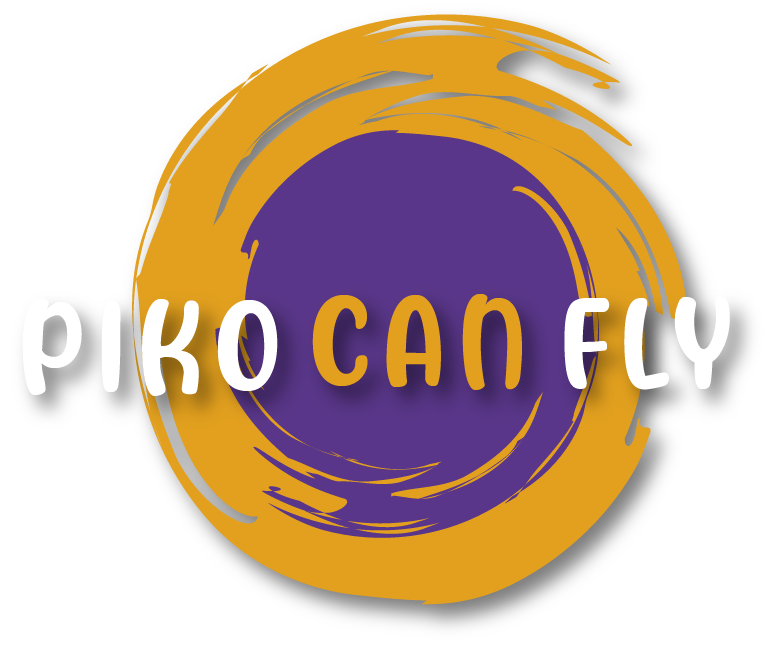

<p><strong>Hi, I am Piko! <a href="https://www.youtube.com/channel/UC8NoIbiu78iGMnh_xezgx8A"></a></strong></p>
<h2 align="left">Writing code makes me feel like I can fly! 🛸</h2>

```javascript
const Piko = {
  pronouns: ["she" || "her" ]
  interests: ["Webdev", "Software Development", "Problem Solving", "Design", "Creative Coding", 
  "researching", "learning new things", "education" ],
  languages: [javaScript, Python, SQL, html, css, typescript, ...more],
  frameworks:[Django, Reactjs, Electron, ....more],   
}
```


  <br>

<a href="https://maia-mlynczak.onrender.com/" target="_blank">👀 view some of my projects.</a>


